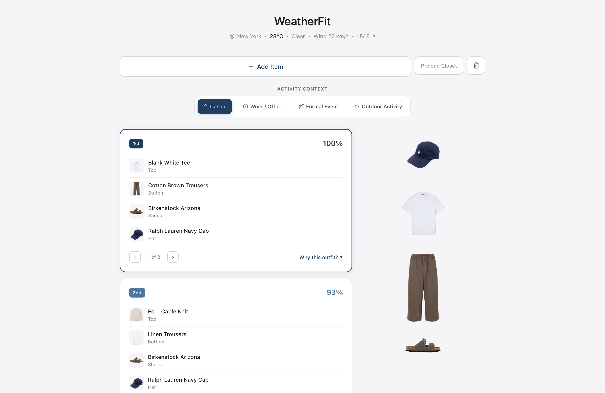
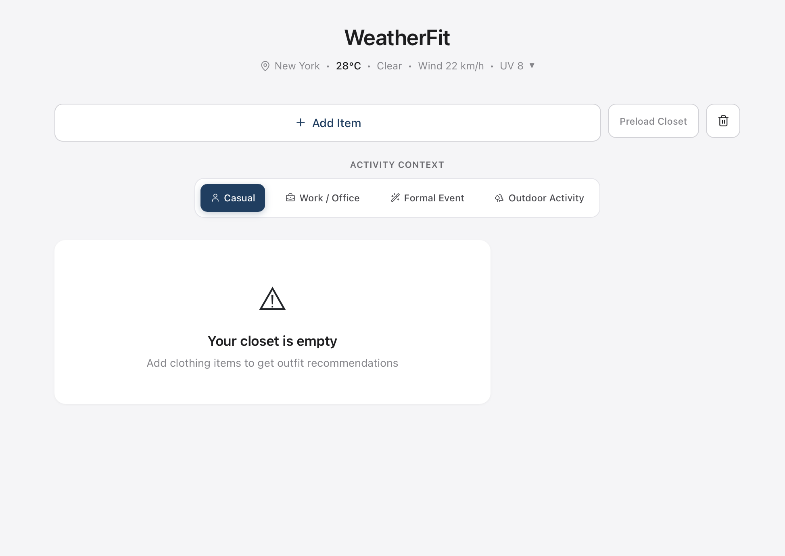
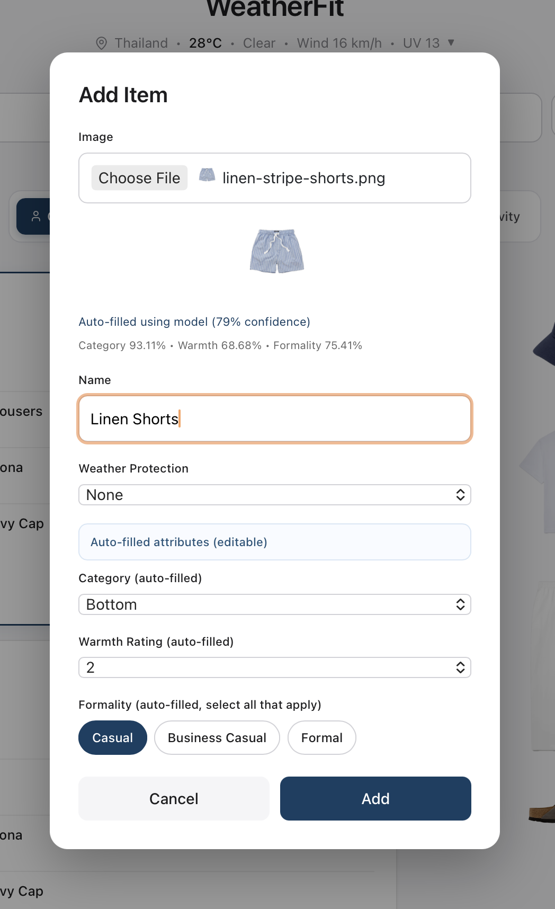

# WeatherFit

WeatherFit is a full-stack outfit recommendation system that combines rule-based decision logic, live weather signals, and ML-assisted wardrobe attribute extraction.



[Demo Video](https://www.youtube.com/watch?v=gc6y_KwtZJg)

## What it does

- Recommends outfits from a personal wardrobe based on weather and activity context
- Considers more than temperature (rain, wind, conditions, and context)
- Supports manual item entry and ML-assisted auto-fill for wardrobe attributes
- Persists user accounts and wardrobe items with backend authentication and storage
- Provides item management (create, list, delete) with duplicate protection logic

## Tech stack

- React + Vite
- FastAPI
- SQLAlchemy + Alembic
- PostgreSQL
- OpenWeatherMap API
- PyTorch (ML service)

## System preview





## Implementation overview

- `src/utils/expertSystem.js` - rule scoring and recommendation logic
- `src/components/` - UI flows (auth, add/delete item modals, activity selector)
- `src/utils/authApi.js` - frontend API client for auth and items
- `backend/app/routes/` - API endpoints (`auth`, `items`, `health`)
- `backend/app/models/` - SQLAlchemy models (`users`, `wardrobe_items`)
- `backend/alembic/` - schema migration history

## Engineering approach

WeatherFit started as a frontend-only expert system and evolved into a production-style full-stack application. The main focus was reliability of user state and recommendation inputs:

- moved storage from local IndexedDB-style behavior to authenticated backend persistence
- added JWT auth + Google OAuth flow so wardrobe data is user-scoped
- added backend deduplication and frontend grouping guards to reduce duplicate items
- preserved key UX state (for example city selection) across refreshes
- improved auth and delete flows to avoid stale UI state after account/session changes

## Experiments and observations

The ML attribute classifier performs strongly on:

- Category: **98.77%**
- Formality: **89.83%**

Warmth remains the hardest prediction target:

- Warmth: **73.69%**

Label simplification from 27 to 5 category groups improved category performance by **+2.92%**, but real-world uploads are still harder than curated product-style images.

## Run locally

### 1) Frontend

Requires [Node.js](https://nodejs.org).

```bash
cp .env.example .env
```

Set at least:

- `VITE_OPENWEATHER_API_KEY=...`
- `VITE_GOOGLE_CLIENT_ID=...` (optional, enables Google sign-in)

```bash
npm install
npm run dev
```

Open `http://localhost:3000`.

### 2) Backend API (FastAPI + PostgreSQL)

```bash
cd backend
python3 -m venv .venv
source .venv/bin/activate
pip install -r requirements.txt
cp .env.example .env
```

Set:

- `DATABASE_URL=...`
- `JWT_SECRET=...`
- `GOOGLE_CLIENT_ID=...` (optional, should match frontend OAuth client ID)

Run migrations and start the API:

```bash
alembic upgrade head
uvicorn app.main:app --reload --port 8001
```

Health check:

- `GET /api/health`

Auth endpoints:

- `POST /api/auth/register`
- `POST /api/auth/login`
- `POST /api/auth/google`
- `GET /api/auth/me`

Items endpoints:

- `GET /api/items`
- `POST /api/items`
- `DELETE /api/items/{item_id}`

## Current limitations

- Recommendation quality depends on item metadata quality (manual or ML-filled)
- ML warmth prediction remains weaker than category/formality
- Rule-based decisions can still miss nuanced personal style preferences
- Google sign-in requires correct OAuth origin setup in Google Cloud Console

## Academic integrity note

The trained model weights are intentionally not included in this repository, primarily to maintain academic integrity. The full ML service implementation and integration flow are provided, and the system can be run with your own trained checkpoint (`best_model.pth`) in `ml-service/` (or via `ML_MODEL_PATH`).
